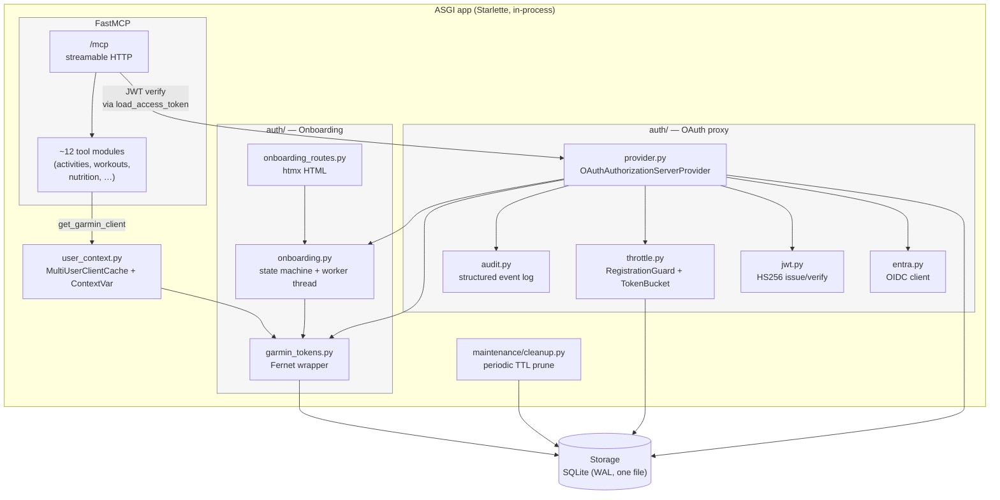

# 5. Building block view

## Whitebox: the ASGI app

## Block reference

### `server.py` — ASGI assembly

The composition root. Two factories:

- `make_app(...)` — the testable shape. Accepts an explicit `client_cache`,
  optional `auth_provider`, optional `onboarding_manager`, and a list of
  `background_task_factories`.
- `make_production_app()` — the env-var-driven entry point used by the
  `garmin-mcp-http` script. Reads `MCP_PUBLIC_URL`, `JWT_SIGNING_KEY`,
  `GARMIN_MCP_DATA_KEY`, `ENTRA_*`, builds every dependency, calls
  `make_app(...)`.

The lifespan installs the per-user cache, starts background tasks, runs
the FastMCP session manager, and tears all of it down on shutdown.

### `auth/storage.py` — SQLite persistence

One class (`Storage`) with thread-safe sync methods. Tables:

| Table | Owner of writes | Purpose |
|---|---|---|
| `oauth_clients` | provider.register_client | DCR registry |
| `pending_authorizations` | provider.authorize | Mid-flight Entra exchanges (state → Claude params) |
| `oauth_codes` | provider._issue_code_for | Codes we issue to Claude after Entra auth |
| `refresh_tokens` | provider._mint_token_pair | Long-lived (30d) refresh tokens |
| `users` | provider.complete_authorization | Entra `(sub, tid)` → internal `user_id` |
| `garmin_tokens` | onboarding worker on success | Fernet-encrypted blob per user |
| `rate_limit_buckets` | throttle.TokenBucket | Persisted token-bucket state |
| `schema_version` | _init_schema | Forward-compat upgrade marker |

WAL mode + a single `threading.Lock` around writes. Reads bypass the lock.

### `auth/provider.py` — OAuth proxy

Implements `OAuthAuthorizationServerProvider` from the MCP SDK. FastMCP
auto-mounts the OAuth endpoints (`/register`, `/authorize`, `/token`,
`/.well-known/...`) and routes them into this class. The Entra `/callback`
is a custom Starlette route (not part of the protocol) that calls
`complete_authorization` to finish the flow.

Key branch in `complete_authorization`: if the user has Garmin tokens →
issue our auth code immediately and bounce to Claude; if not → divert
through `/onboard` and resume after the worker finishes.

### `auth/onboarding.py` + `onboarding_routes.py`

The worker thread + state machine. See chapter 6 for the sequence.

### `auth/garmin_tokens.py` — Fernet wrapper

Thin layer over `Storage.{save,load,delete,has}_garmin_token`. Encrypts
on write, decrypts on read. The Fernet key comes from
`GARMIN_MCP_DATA_KEY`. A failed decrypt raises a clear "key was rotated"
error rather than handing back garbage.

### `user_context.py` — per-request user lookup

Two caches (interchangeable):

- `SingleUserClientCache(client)` — stdio mode and the no-auth HTTP test
  path. Returns the same client for any user_id.
- `MultiUserClientCache(token_store, ...)` — production. Lazy-load on
  miss, in-memory cache with 30-min idle TTL, fully-built `Garmin`
  instance per user.

Tools call `get_garmin_client()` which resolves
`current_user_id() → cache.get_or_load(user_id) → Garmin`. The
ContextVar is set inside the JWT verifier (provider.load_access_token).

### `maintenance/cleanup.py` — background TTL prune

Single async function `cleanup_loop(storage, interval=3600)`. Runs as a
task in the lifespan. Each tick: drop expired pending auths, prune
oauth_clients that registered but never exchanged a token (>24h) or
haven't been used in 90 days.

## Levels above this

There is no second instance, no shared state across processes, no
sidecar. The "system" is one container behind one Caddy.
