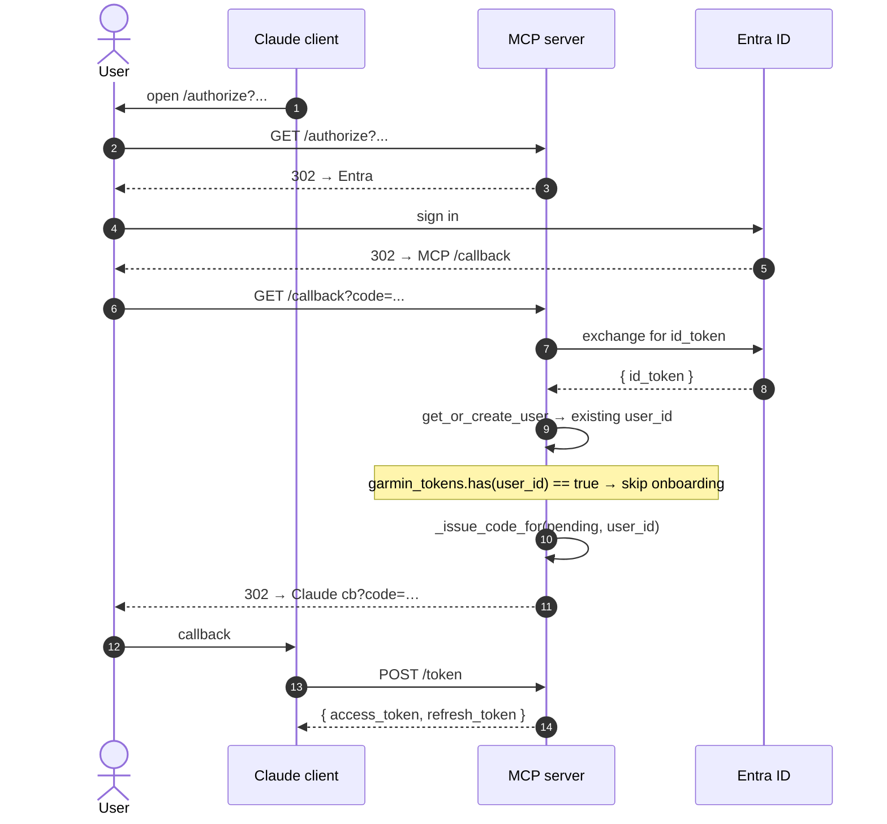
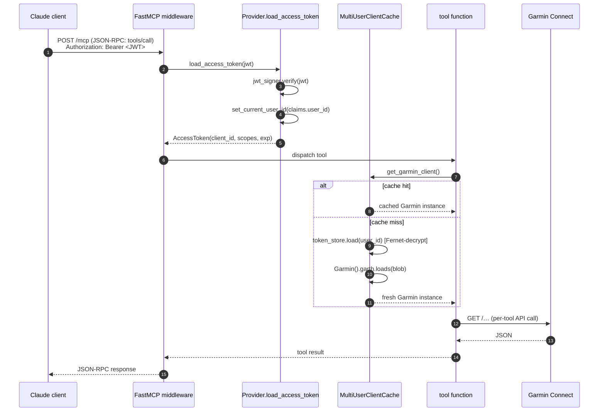

# 6. Runtime view

The four flows that matter. Each one is a single sequence diagram with
line-by-line notes.

## 6.1 First-time user authentication + onboarding

```mermaid
sequenceDiagram
    autonumber
    actor U as User (browser)
    participant CL as Claude client
    participant MCP as MCP server
    participant E as Entra ID
    participant G as Garmin Connect

    Note over CL,MCP: Discovery + DCR
    CL->>MCP: GET /.well-known/oauth-protected-resource/mcp
    MCP-->>CL: { authorization_servers: [<MCP_PUBLIC_URL>] }
    CL->>MCP: POST /register (DCR)
    MCP-->>CL: 201 { client_id, client_secret? }

    Note over CL,U: Authorization code flow
    CL->>U: open /authorize?... in browser
    U->>MCP: GET /authorize?...
    MCP->>MCP: persist pending_authorization, build Entra URL
    MCP-->>U: 302 → Entra login

    U->>E: sign in (single-tenant)
    E-->>U: 302 → MCP /callback?code=...&state=...

    U->>MCP: GET /callback?code=...&state=...
    MCP->>E: POST /token (auth code → id_token)
    E-->>MCP: { id_token }
    MCP->>MCP: validate id_token sig + tid + aud<br/>get_or_create_user(entra_sub, tid)

    Note over MCP: User has no Garmin tokens → divert to /onboard
    MCP->>MCP: onboarding.create_session(user_id, on_success=…)
    MCP-->>U: 302 → /onboard?ticket=…

    Note over U,G: One-time Garmin onboarding (with MFA)
    U->>MCP: GET /onboard?ticket=…
    MCP-->>U: HTML credentials form
    U->>MCP: POST /onboard/credentials (email + password)
    MCP->>MCP: spawn worker thread
    MCP-->>U: panel: AUTHENTICATING

    activate G
    Note right of G: worker thread runs<br/>garth.login()
    G->>MCP: prompt_mfa() callback (blocks)
    MCP->>MCP: state = AWAITING_MFA, queue.get(timeout=5min)

    U->>MCP: GET /onboard/status (htmx polling)
    MCP-->>U: panel: AWAITING_MFA + form
    U->>MCP: POST /onboard/mfa (code)
    MCP->>MCP: queue.put(code); worker resumes
    G-->>MCP: login OK, garth.dumps() → token blob
    deactivate G

    MCP->>MCP: token_store.save(user_id, blob) [Fernet-encrypt]
    MCP->>MCP: on_success → _issue_code_for(pending, user_id)
    MCP->>MCP: state = COMPLETE, redirect_url = Claude cb

    U->>MCP: GET /onboard/status
    MCP-->>U: panel: COMPLETE + JS redirect
    U->>CL: Claude callback?code=…&state=…

    Note over CL,MCP: Token exchange
    CL->>MCP: POST /token (code + PKCE verifier)
    MCP->>MCP: consume_authorization_code, mint JWT + refresh
    MCP-->>CL: { access_token (JWT), refresh_token, expires_in }
```

Critical bits:

- **State 9** (provider.complete_authorization checks `garmin_tokens.has(user_id)`)
  is the branch point between this flow and 6.2.
- **State 18** (`prompt_mfa` blocks the worker thread on a `Queue`) is the
  bridge between garth's sync API and the async web layer.
- The MFA queue has a 5 min timeout. If the user takes longer the worker
  raises and the session moves to FAILED.

## 6.2 Returning user authentication



Same flow as the first-time path minus the `/onboard` detour.

## 6.3 Tool call by an authenticated client



The ContextVar set in step 4 makes all of this work without tools
knowing they're running on behalf of a specific user.

## 6.4 Garmin token refresh on expiry

`garth` tokens last ~6 months. When they expire, the next tool call
fails inside `garth` with a 401 / authentication error. We catch this
in the cache:

1. Tool calls `get_garmin_client()` → cached client returned
2. Tool calls a method on the client → `garth` raises a 401
3. The error bubbles up to the MCP layer; current MVP behavior is to
   return a clear "your Garmin session expired — visit /onboard to
   re-authenticate" error to the client
4. User re-runs onboarding (a separate `/onboard?ticket=…` link is
   issued; the same `user_id` row is updated with fresh tokens)
5. Cache is invalidated for that user; next tool call rebuilds it

The "issue a /onboard link from a tool error" wiring is currently
deferred — a future improvement is to detect 401s automatically and
push a session-restart prompt back through MCP. Tracked in
[chapter 11](11-risks-and-technical-debt.md).
