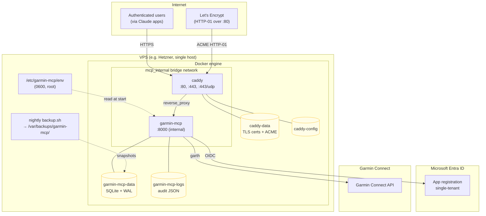

# 7. Deployment view

## Topology



## Nodes

### VPS

Single Linux host (e.g. Hetzner CX11/CAX11). Runs Docker engine, holds
the env file at `/etc/garmin-mcp/env` (mode 0600, owned by root) and a
crontab entry that runs `deploy/backup.sh` nightly.

### `garmin-mcp` container

Built from [`deploy/Dockerfile`](../deploy/Dockerfile). Multi-stage:

- **Builder stage** — `ghcr.io/astral-sh/uv:0.5-python3.13-bookworm-slim`,
  `uv sync --frozen --no-dev` to materialize the `.venv`.
- **Runtime stage** — `python:3.13-slim`, non-root user uid/gid 1000,
  predefined `GARMIN_MCP_DATA_PATH=/var/lib/garmin-mcp/state.db` and
  `GARMIN_MCP_AUDIT_DIR=/var/log/garmin-mcp` env vars, HEALTHCHECK
  hits `/healthz`. CMD is `garmin-mcp-http` which calls
  `make_production_app()`.

Bound to `0.0.0.0:8000` *inside* the container, but the compose file
**does not publish that port** — only Caddy reaches it via the
`mcp_internal` bridge network.

### `caddy` container

Stock `caddy:2`. Mounts `deploy/Caddyfile` read-only. Publishes
`:80`, `:443`, `:443/udp` (HTTP/3). Auto-fetches Let's Encrypt certs;
state lives in the `caddy-data` volume so cert renewals survive
container restarts.

## Volumes

| Volume | Mount | What's in it |
|---|---|---|
| `garmin-mcp-data` | `/var/lib/garmin-mcp/` | SQLite DB + WAL files. **The only thing you must back up.** |
| `garmin-mcp-logs` | `/var/log/garmin-mcp/` | Daily audit log files (`audit-YYYY-MM-DD.log`) |
| `caddy-data` | `/data` | Issued TLS certs + ACME state |
| `caddy-config` | `/config` | Caddy autosaved config |

## Secrets

| Where | What | How it gets there |
|---|---|---|
| `/etc/garmin-mcp/env` (host, 0600 root) | env file with all secrets | Hand-edited or written by `infra/azure/scripts/deploy.sh` |
| Compose env_file: | mounts the file into the container at start | Passed by `garmin-mcp-http` to all the constructors |
| `GARMIN_MCP_DATA_KEY` | Fernet key | Generated once via `Fernet.generate_key()`; **MUST be backed up** — losing it makes every `garmin_tokens` row unreadable |
| `JWT_SIGNING_KEY` | HS256 secret | Rotating it invalidates all in-flight access tokens; users have to refresh (auto) or re-auth |
| `ENTRA_CLIENT_SECRET` | Entra app secret | Rotated every 90d via `infra/azure/scripts/rotate-secret.sh` |

## Networking

- Inbound: `:80`, `:443`, `:443/udp` reach Caddy. Recommended firewall
  rule: `ufw allow 80,443/tcp`.
- The `mcp_internal` bridge network is the only path to garmin-mcp;
  even from the host, you'd need `docker compose exec` to reach `:8000`.
- Outbound: garmin-mcp connects to `login.microsoftonline.com` and
  `connect.garmin.com`. No proxy support is configured; if the VPS sits
  behind one, set the standard `HTTPS_PROXY` env var.

## Update / rollback

```bash
# update
git -C /opt/garmin-mcp pull
docker compose -f /opt/garmin-mcp/deploy/docker-compose.yml up -d --build

# rollback (any old commit / image)
git -C /opt/garmin-mcp checkout <sha>
docker compose ... up -d --build
```

State migrations are forward-compat-only (`CREATE TABLE IF NOT EXISTS`),
so a rollback to a prior schema version still works as long as the new
tables stay empty (newer code may have written to them).
