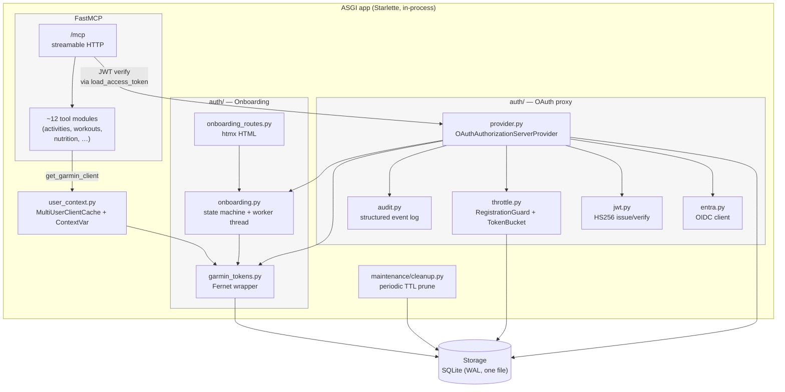

# Building blocks (C4 level 2)

```mermaid
flowchart TB
    subgraph asgi["ASGI app (Starlette, in-process)"]
        direction TB

        subgraph oauth["auth/ — OAuth proxy"]
            provider["provider.py<br/>OAuthAuthorizationServerProvider"]
            entra_mod["entra.py<br/>OIDC client"]
            jwt_mod["jwt.py<br/>HS256 issue/verify"]
            throttle["throttle.py<br/>RegistrationGuard + TokenBucket"]
            audit["audit.py<br/>structured event log"]
        end

        subgraph onboarding["auth/ — Onboarding"]
            mgr["onboarding.py<br/>state machine + worker thread"]
            routes["onboarding_routes.py<br/>htmx HTML"]
            tokens["garmin_tokens.py<br/>Fernet wrapper"]
        end

        subgraph mcp["FastMCP"]
            mcp_endpoint["/mcp<br/>streamable HTTP"]
            tool_modules["~12 tool modules<br/>(activities, workouts,<br/>nutrition, …)"]
        end

        ucontext["user_context.py<br/>MultiUserClientCache + ContextVar"]
        maintenance["maintenance/cleanup.py<br/>periodic TTL prune"]
    end

    storage[("Storage<br/>SQLite (WAL, one file)")]

    provider --> storage
    provider --> entra_mod
    provider --> jwt_mod
    provider --> throttle
    provider --> audit
    provider --> tokens
    provider --> mgr

    routes --> mgr
    mgr --> tokens
    tokens --> storage
    throttle --> storage

    mcp_endpoint -->|JWT verify<br/>via load_access_token| provider
    mcp_endpoint --> tool_modules
    tool_modules -->|get_garmin_client| ucontext
    ucontext --> tokens

    maintenance --> storage

    classDef pkg fill:#f6f6f6,stroke:#888
    class oauth,onboarding,mcp pkg
```
