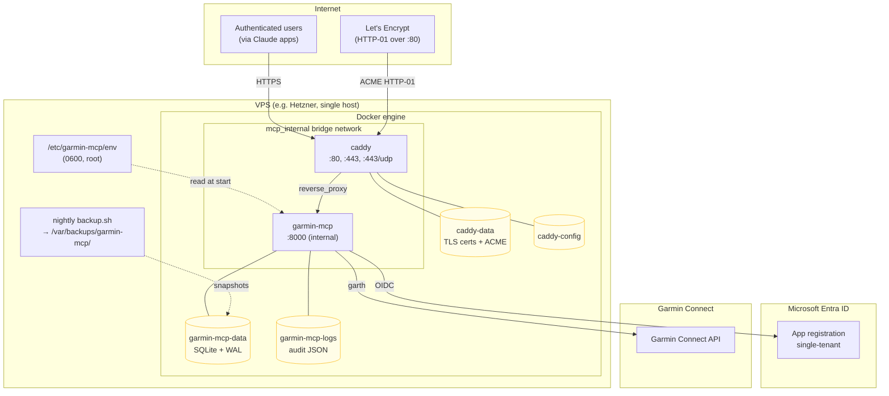

# Deployment view

```mermaid
flowchart TB
    subgraph internet["Internet"]
        users["Authenticated users<br/>(via Claude apps)"]
        le["Let's Encrypt<br/>(HTTP-01 over :80)"]
    end

    subgraph vps["VPS (e.g. Hetzner, single host)"]
        subgraph docker["Docker engine"]
            subgraph mcp_internal["mcp_internal bridge network"]
                caddy["caddy<br/>:80, :443, :443/udp"]
                app["garmin-mcp<br/>:8000 (internal)"]
            end

            v_state[("garmin-mcp-data<br/>SQLite + WAL")]
            v_logs[("garmin-mcp-logs<br/>audit JSON")]
            v_caddy_data[("caddy-data<br/>TLS certs + ACME")]
            v_caddy_cfg[("caddy-config")]

            app --- v_state
            app --- v_logs
            caddy --- v_caddy_data
            caddy --- v_caddy_cfg
        end

        env_file["/etc/garmin-mcp/env<br/>(0600, root)"]
        backup_cron["nightly backup.sh<br/>→ /var/backups/garmin-mcp/"]

        env_file -.read at start.-> app
        backup_cron -.snapshots.-> v_state
    end

    subgraph azure["Microsoft Entra ID"]
        app_reg["App registration<br/>single-tenant"]
    end

    subgraph external["Garmin Connect"]
        garmin_api["Garmin Connect API"]
    end

    users -->|HTTPS| caddy
    caddy -->|reverse_proxy| app

    le -->|ACME HTTP-01| caddy

    app -->|OIDC| app_reg
    app -->|garth| garmin_api

    classDef vol fill:#fffde7,stroke:#fbc02d
    class v_state,v_logs,v_caddy_data,v_caddy_cfg vol
```
