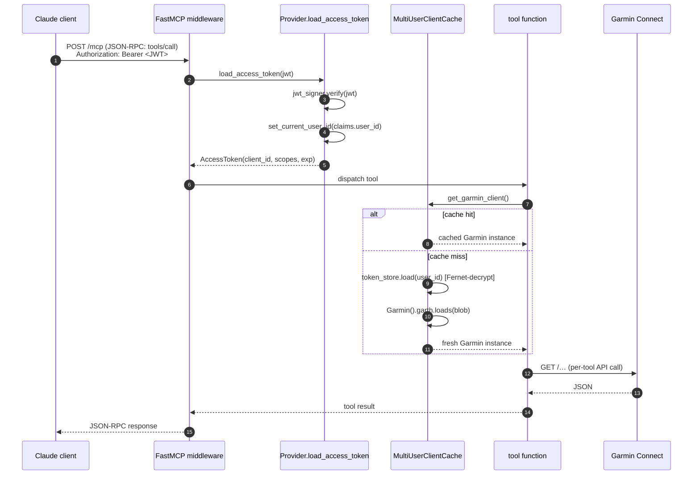

# Runtime: tool call by an authenticated client

```mermaid
sequenceDiagram
    autonumber
    participant CL as Claude client
    participant MW as FastMCP middleware
    participant P as Provider.load_access_token
    participant Cache as MultiUserClientCache
    participant Tool as tool function
    participant G as Garmin Connect

    CL->>MW: POST /mcp (JSON-RPC: tools/call)<br/>Authorization: Bearer <JWT>
    MW->>P: load_access_token(jwt)
    P->>P: jwt_signer.verify(jwt)
    P->>P: set_current_user_id(claims.user_id)
    P-->>MW: AccessToken(client_id, scopes, exp)
    MW->>Tool: dispatch tool

    Tool->>Cache: get_garmin_client()
    alt cache hit
        Cache-->>Tool: cached Garmin instance
    else cache miss
        Cache->>Cache: token_store.load(user_id) [Fernet-decrypt]
        Cache->>Cache: Garmin().garth.loads(blob)
        Cache-->>Tool: fresh Garmin instance
    end

    Tool->>G: GET /…  (per-tool API call)
    G-->>Tool: JSON
    Tool-->>MW: tool result
    MW-->>CL: JSON-RPC response
```

The ContextVar set in step 4 makes all of this work without tools knowing
they're running on behalf of a specific user.
